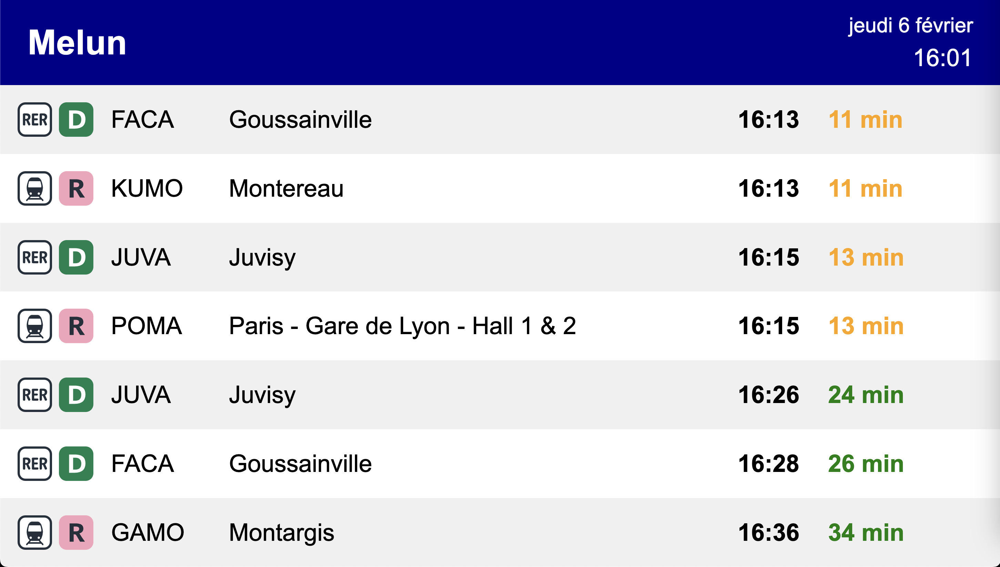

# SNCF Departure Board

This project is a simple display board for SNCF train departures. It uses the SNCF API to get the data. It is written in Python and uses the FastAPI web framework.



## Installation

### Install dependencies with uv

```bash
uv sync && . .venv/bin/activate
```

### Run the server with FastAPI

```bash
fastapi run
```

Go to [http://localhost:8000](http://localhost:8000) to see the display board.
